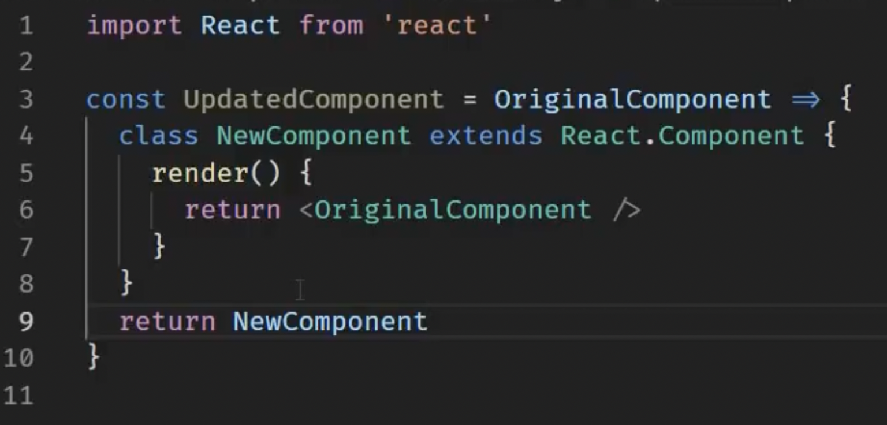

## HOC

* React HOCs are use to share common logic between components. So where there is some commmon functionality or code in components Higer order component can be used to prevent code duplication and in efficient manner.

* HOC function component takes a original component & returns an updated component as a result.

* Below is the screenshot to use HOC

